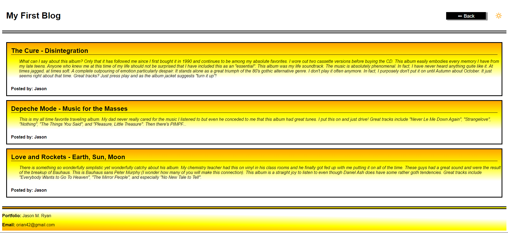

# Personal Blog

## Description

### User Story
The purpose of this application was so that a user (a marketing student in particular for this project) could record their thoughts and experiences in blog entries.  These entries are able to be recalled and read by anyone who had the link to the application.  The user would be able to enter their name, the title of the blog entry, and whatever thoughts or experiences they would like to share.  When entered, the user would be redirected to a page that would list all blog entries recorded thus far displayed in the order in which they were recorded starting with the first entry and ending with the last.  The user would also be able to select a theme for the display of the page itself.  There are two options: a light mode and a dark mode.

### My Student Experience
From a student perspective, this was a wonderful learning experience for me!  Not only was I able to apply much of what I learned in the past week, I was able to augment my knowledge researching different issues that I wanted to add that were not required by the user story.

One of the things I wanted my application to have is that when I selected either light mode or dark mode, I wanted that mode to be stored so that when the user went from one page to another, the mode would remain.  I noticed it was rather jarring to be in dark mode and then get navigated to the other page only to have the light mode jump up.  I wanted more consistency with my application.  I was able to easily accomplish this by storing a second value in the local storage that could be recalled every time one of the pages were loaded and set the corresponding mode correctly.

The user story required that I include an alert if any of the fields were left blank when trying to submit the form.  Rather than a single alert that came up telling the user to finish the form, I wanted a more descriptive alert that would tell the user which form field were blank.  I also wanted that list of fields to be bulleted in the alert itself so it could be easily read.  I had to do some research to learn how to insert line breaks to be able to display this correctly.

I also picked up some more CSS knowledge!  The linear and radial gradient fills have accented my application rather nicely I think.  I was able to set up two different color schemes with a sunny-feeling light mode and a gloomy-feeling dark mode.  I lined the gradients up so that the switch from light to dark mode appears very clean.

## Installation

N/A

## Usage

Anyone with the link to the application (https://orian42.github.io/personal_blog/index.html) may use it. It should be noted that this is a student project and should not be regarded as a real-world tool.

Begin use by entering the information as appropriate on the home page and click the Submit button to submit the entry.  All fields must be filled in; otherwise, the entry will not be submitted.  Once the entry is submitted, the user will be redirected to the posts page where the user will be able to read all blog entries submitted to date.  From this page, the user can select the back button to return to the home page to submit an additional blog entry.  

The user also has the ability to switch the color scheme to either a light mode or dark mode based on the user's preference.  This is done by clicking the sun or moon icon in the upper right corner of either page.  This preference will remain in effect for both pages every time the user visits the page until the mode is switched by the user.

My portfolio can be viewed by clicking my name at the bottom of the posts page.

### The Home Screen

### The Posts Screen

## Credits

No other person aided in my creation of this application.

Research into additional commands was conducted using multiple websites too numerous to name.

## License

Please refer to the LICENSE in the repo.